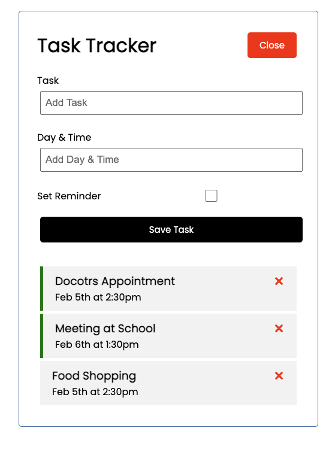

# Task Tracker App

## User Story

AS a user I would like have an application where I can add and delete tasks to a list with a reminder and a date

GIVEN A Single-page application for a task tracker

<ul>
<li>WHEN I load the application</li>
<li>THEN I am presented with a simple interface with static data already in place in a list</li>
<li>WHEN I click the green Add button</li>
<li>THEN two input fields add task and add day and time and a reminder check box will appear</li>
<li>WHEN I click the red Close button</li>
<li>THEN the two input fields will disappear</li>
<li>WHEN I input text into the input fields and click save task</li>
<li>THEN the inputed text will appear at the bottom of the list</li>
<li>WHEN I input text into the input field and also check the set reminder box</li>
<li>THEN the inputed text will appear at the bottom of the list with a green line to the left of the box</li>
<li>WHEN I click the red X in the box</li>
<li>THEN the inputed data box will be deleted from the list</li>
<li>When I double click on the data box</li>
<li>THEN the data box will add or delete a green line indicating a reminder</li>
</ul>

### Please open terminal and run `npm start` to use app

## Snap shot of application

 

